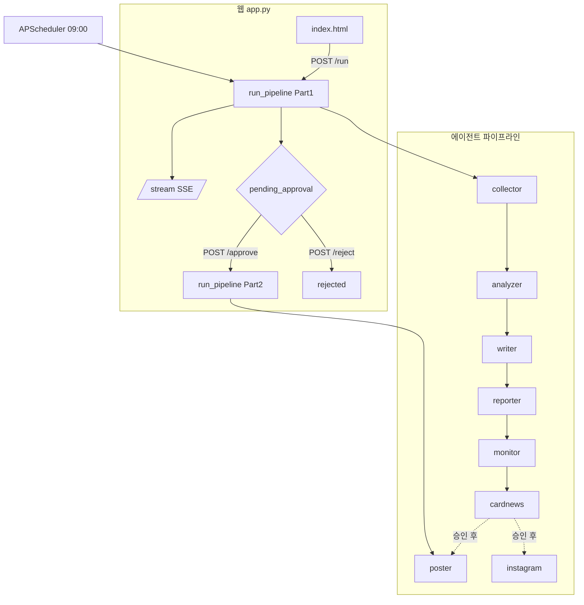
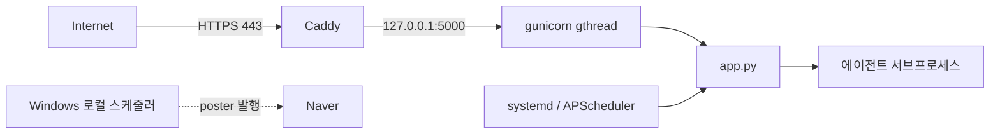

# 아키텍처 / API 문서

마케팅 자동화 시스템의 구조, 파이프라인, 웹 API, 데이터 모델을 정리한다.
(에이전트별 실행법은 [README](../README.md), 보안은 [security.md](security.md) 참고)

---

## 1. 시스템 개요

키워드 입력 → 수집·분석·콘텐츠 생성·리포트·발행까지 자동화하는 멀티 에이전트 시스템.
각 에이전트는 **독립 서브프로세스**로 실행되어 장애가 격리되고, 단계 산출물은 모두
파일(JSON/PNG/PDF)로 디스크에 영속화되어 다음 단계의 입력이 된다.

실행 경로는 둘이다:

| 경로 | 진입점 | 용도 |
|------|--------|------|
| CLI | `orchestrator.py` | 일괄 7단계 순차 실행 (`--resume` 재개 지원) |
| 웹 | `app.py` (Flask) | 2단계 승인 게이트 + SSE 실시간 + 스케줄러 |



---

## 2. 파이프라인 단계

| # | 에이전트 | 입력 | 출력 | 외부 의존 |
|---|---------|------|------|-----------|
| 1 | collector | 키워드 | `data/{kw}_{date}.json` | 네이버 검색 API |
| 2 | analyzer | 수집 JSON | `data/analyzed_{kw}_{date}.json`, `history.json` | Gemini, 데이터랩 |
| 3 | writer | 분석 JSON | `output/content_{kw}_{date}.json` | Gemini |
| 4 | reporter | content 전체 | `output/report_{date}.{html,pdf}` | Gemini, Jinja2, Playwright |
| 5 | monitor | 키워드 | `data/monitor_log_{date}.json` | 네이버 API, Gemini |
| 6 | cardnews | 분석 JSON | `output/cardnews_{kw}_{date}_{1..4}.png` | Pillow |
| 7a | poster | content JSON | 네이버 블로그 발행 | Playwright(쿠키 세션) |
| 7b | instagram | content JSON | IG 발행 | Graph API, Unsplash |

부가: `sales`(리드 수집/메일), `healthcheck`(산출물 점검).

**웹 2단계 게이트**: Part1(collector→…→cardnews) 완료 시 `pending_approval`로 멈추고,
사용자가 콘텐츠를 검토/편집 후 승인하면 Part2(poster, instagram)가 발행한다.
스케줄러 자동 실행은 `auto_post=True`로 승인 없이 Part2까지 진행한다.

---

## 3. 웹 API 레퍼런스 (`app.py`)

`ADMIN_USER`+(`ADMIN_PASSWORD`|`ADMIN_PASSWORD_HASH`) 설정 시 인증 필요.
**인증 면제**: `/login`, `/stream/*`, `/cardnews/*`.

| 메서드 | 경로 | 설명 |
|--------|------|------|
| GET/POST | `/login` | 로그인 폼/세션 인증 (5회 실패 시 15분 잠금) |
| GET | `/logout` | 세션 해제 |
| GET | `/` | 대시보드 (index.html) |
| POST | `/run` | 파이프라인 시작 → `{job_id}` 반환 (백그라운드 스레드) |
| GET | `/stream/<job_id>` | SSE 실시간 진행 스트림 |
| POST | `/approve/<job_id>` | 콘텐츠 승인 → Part2(발행) 시작 |
| POST | `/reject/<job_id>` | 거부 → `rejected` |
| POST | `/edit-content/<date>/<keyword>` | 승인 전 콘텐츠 수정 저장 (얕은 병합) |
| GET | `/result/<date>/<keyword>` | 생성된 콘텐츠 JSON 조회 |
| GET | `/cardnews/<filename>` | 카드뉴스 PNG 서빙 |
| GET | `/cardnews-files/<date>/<keyword>` | 키워드별 카드뉴스 파일 목록 |
| GET | `/history` | 최근 20개 잡 (DB) |
| POST | `/rerun/<job_id>` | 과거 잡 재실행 |
| POST | `/test-notify` | 이메일/Slack 알림 테스트 |
| GET | `/download/<date>` | 리포트 PDF 다운로드 |

### SSE 메시지 포맷 (`/stream/<job_id>`)
`data: <PREFIX>:<내용>\n\n` 형식, 60초마다 `PING` keepalive.

| 프리픽스 | 의미 |
|----------|------|
| `STEP:` | 현재 진행 단계명 |
| `LOG:` | 서브프로세스 stdout |
| `ERROR:` | 치명 오류 (status=error) |
| `PENDING:<date>` | Part1 완료, 승인 대기 |
| `DONE:<date>` | 전체 완료 |
| `REJECTED` | 사용자 거부 |

---

## 4. 데이터 모델

### `data/jobs.db` — SQLite `jobs` 테이블 (`utils/job_store.py`)

| 컬럼 | 타입 | 비고 |
|------|------|------|
| `job_id` | TEXT PK | 8자리 hex |
| `status` | TEXT | 아래 상태값 |
| `keywords` | TEXT | JSON 배열 |
| `date` | TEXT | YYYY-MM-DD |
| `created_at` | TEXT | ISO8601 |
| `updated_at` | TEXT | ISO8601 |

**상태 전이**:
```
running ──Part1 성공──> pending_approval ──approve──> posting ──Part2 성공──> done
   │                          │                                       
   └─오류─> error             └─reject─> rejected                     
서버 재시작 시 running → interrupted (init_db 의 mark_interrupted)
```

### 파일 산출물

| 디렉터리 | 패턴 | 생성 주체 |
|----------|------|-----------|
| `data/` | `{kw}_{date}.json` | collector |
| `data/` | `analyzed_{kw}_{date}.json` | analyzer |
| `data/` | `history.json` | analyzer (예측 검증 추적) |
| `data/` | `monitor_state.json`, `monitor_log_{date}.json` | monitor |
| `data/` | `naver_cookies.json` (암호화), `.enc_key`, `.flask_secret` | poster/app |
| `data/` | `pipeline_checkpoint_{date}.json` | orchestrator `--resume` |
| `output/` | `content_{kw}_{date}.json` | writer |
| `output/` | `report_{date}.{html,pdf}` | reporter |
| `output/` | `cardnews_{kw}_{date}_{1..4}.png` | cardnews |
| `logs/` | `pipeline_*.log`, `analyzer_*.log`, `instagram_*.log`, `healthcheck_*.log` | 구조적 로깅 |

> `data/`, `output/`, `logs/` 는 gitignore 대상. 7일 경과 파일은 `utils/cleanup.py`가
> 매일 02:00 정리(상태 파일 보존).

---

## 5. 공용 모듈 (`utils/`)

| 모듈 | 역할 |
|------|------|
| `job_store.py` | 잡 상태 SQLite CRUD |
| `logging_setup.py` | 구조적 로깅(콘솔+회전 파일) |
| `config.py` | `env_int` — 상한값 환경변수화 |
| `checkpoint.py` | 파이프라인 완료 단계 기록/재개 |
| `secrets.py` | 쿠키 등 at-rest Fernet 암호화 |
| `auth_guard.py` | 자격증명 상수시간 검증 + 로그인 시도 제한 |
| `gemini_retry.py` | Gemini 호출 tenacity 재시도 |
| `notifier.py` / `alert_sender.py` / `email_sender.py` | 이메일·Slack 알림 |
| `cleanup.py` | 오래된 파일 정리 |

---

## 6. 배포 토폴로지



- GCP e2-micro(Debian 12), systemd + gunicorn(단일 워커/`gthread`/`--timeout 0`).
- HTTPS 는 Caddy 리버스 프록시로 종단 (`deploy/Caddyfile`, `FORCE_HTTPS=1`).
- poster 봇 감지 회피는 스텔스+프록시(`POSTER_PROXY`) 또는 Windows 로컬 스케줄러.
